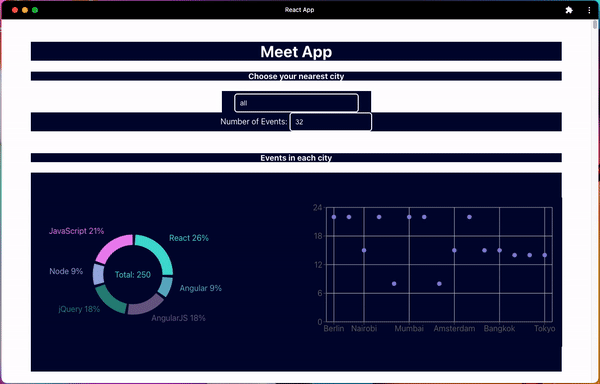

# Meet

## Objective

To build a serverless, progressive web application (PWA) with React using a
test-driven development (TDD) technique. The application uses the Google
Calendar API to fetch upcoming events.

## SCENARIO 1: WHEN USER HASN’T SEARCHED FOR A CITY, SHOW UPCOMING EVENTS FROM ALL CITIES.

Given user hasn’t searched for any city
When the user opens the app
Then the user should see a list of all upcoming events

## SCENARIO 2: USER SHOULD SEE A LIST OF SUGGESTIONS WHEN THEY SEARCH FOR A CITY.

Given the main page is open
When user starts typing in the city textbox
Then the user should see a list of cities (suggestions) that match what they’ve typed

## SCENARIO 3: USER CAN SELECT A CITY FROM THE SUGGESTED LIST.

Given the user was typing “Berlin” in the city textbox, and the list of suggested cities is showing
When the user selects a city (e.g., “Berlin, Germany”) from the list
Then their city should be changed to that city (i.e., “Berlin, Germany”)
And the user should receive a list of upcoming events in that city

## SCENARIO 4: USE THE APP WHEN OFFLINE.

Given the user wants to access all data.
When the user is offline.
Then the user receives an error when user changes settings.

## SCENARIO 5: DATA VISUALIZATION.

Given a page that shows the number of upcoming events in each city.
When the user selects the show all events page.
Then the user sees a chart indicating how many events each city has
